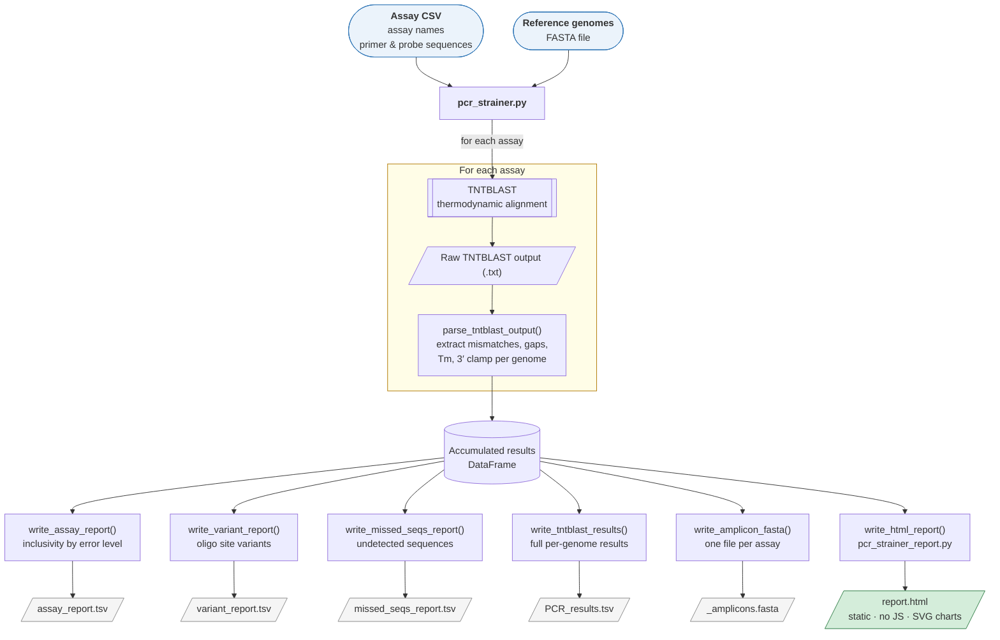

# PCR_strainer

PCR_strainer assesses the inclusivity of primer and probe oligonucleotides from diagnostic qPCR assays and amplicon sequencing schemes against large sets of reference genome sequences. It wraps [thermonucleotideBLAST (TNTBLAST)](https://github.com/jgans/thermonucleotideBLAST), which aligns query oligonucleotides to subject sequences with a thermodynamic model, and produces tabular reports and a self-contained HTML summary report suitable for sharing with laboratory staff.

This is the BCCDC-PHL fork of [Kevin Kuchinski's PCR_strainer](https://github.com/KevinKuchinski/PCR_strainer), extended with additional TNTBLAST output fields, a static HTML summary report, and a more maintainable code structure.

---

## How it works



---

## Publications

If you use PCR_strainer in your work, please cite the original publications:

1. Kuchinski KS, Jassem AN, Prystajecky NA. Assessing oligonucleotide designs from early lab developed PCR diagnostic tests for SARS-CoV-2 using the PCR_strainer pipeline. *J Clin Virol.* 2020 Oct;131:104581. doi: [10.1016/j.jcv.2020.104581](https://doi.org/10.1016/j.jcv.2020.104581). PMID: 32889496.
2. Kuchinski KS, Nguyen J, Lee TD, Hickman R, Jassem AN, Hoang LMN, Prystajecky NA, Tyson JR. Mutations in emerging variant of concern lineages disrupt genomic sequencing of SARS-CoV-2 clinical specimens. *Int J Infect Dis.* 2022 Jan;114:51-54. doi: [10.1016/j.ijid.2021.10.050](https://doi.org/10.1016/j.ijid.2021.10.050). PMID: 34757201.

---

## Dependencies

| Dependency | Notes |
|---|---|
| [TNTBLAST](https://github.com/jgans/thermonucleotideBLAST) | Must be installed and on your `PATH` |
| Python ≥ 3.8 | |
| pandas | TSV parsing and report generation |
| numpy | Numerical operations |
| matplotlib | Chart rendering in the HTML report (Agg backend — no display required) |

> **pandas compatibility:** PCR_strainer is compatible with pandas ≥ 1.0 and has been tested with pandas 2.x. Several pandas 2.0 API changes are handled explicitly in the code.

All Python dependencies are available via conda-forge or pip and are standard in most scientific Python environments (Anaconda, conda-forge).

---

## Installation

**1. Install TNTBLAST**

Follow the build instructions at https://github.com/jgans/thermonucleotideBLAST and ensure `tntblast` is available on your `PATH`.

**2. Install Python dependencies**

```bash
pip install pandas numpy matplotlib
# or
conda install -c conda-forge pandas numpy matplotlib
```

**3. Clone this repository**

```bash
git clone https://github.com/BCCDC-PHL/PCR_strainer.git
cd PCR_strainer
```

---

## Usage

```bash
python pcr_strainer.py \
    -a assays.csv \
    -g genomes.fasta \
    -o results/run_name \
    [optional arguments]
```

### Required arguments

| Flag | Description |
|---|---|
| `-a` | Path to assay CSV file (see [Assay file format](#assay-file-format)) |
| `-g` | Path to reference genomes in FASTA format |
| `-o` | Output prefix: path + base name for output files (e.g. `results/run1` writes `results/run1_*.tsv` and `results/run1_report.html`) |

### Optional arguments

| Flag | Default | Description |
|---|---|---|
| `-m` | 45 | Minimum Tm (°C) for primers and probes |
| `-t` | 0 | Minimum prevalence (%) of variants to include in reports. `0` reports everything; must be `> 0` and `< 100` if set |
| `-p` | 1 | Molar concentration of primer oligos (µM) |
| `-P` | 1 | Molar concentration of probe oligos (µM) |

### Diagnostic arguments

| Flag | Description |
|---|---|
| `--keep-tntblast-output` | Retain the raw TNTBLAST output file for each assay (`<assay>_tntblast_output.txt`) in the output directory. Useful for diagnosing unexpected results in site sequence alignment or probe orientation. Files are deleted after parsing by default. |

### Example

```bash
python pcr_strainer.py \
    -a assays/influenza_assays.csv \
    -g genomes/influenza_HA_2024.fasta \
    -o results/flu_HA_2024 \
    -m 50 \
    -t 1
```

This runs all assays in `influenza_assays.csv` against `influenza_HA_2024.fasta`, requires Tm ≥ 50 °C, and reports variants present in ≥ 1% of detected genomes. Output files are written to the `results/` directory.

---

## Assay file format

The assay CSV has one assay per line with no header row. Lines with a probe use 7 fields; lines without a probe use 5 fields.

**With probe (qPCR):**
```
assay_name,fwd_primer_name,fwd_primer_seq,rev_primer_name,rev_primer_seq,probe_name,probe_seq
```

**Without probe (conventional PCR or amplicon sequencing):**
```
assay_name,fwd_primer_name,fwd_primer_seq,rev_primer_name,rev_primer_seq
```

**Rules:**
- All oligo sequences should be written 5′ → 3′
- IUPAC degenerate bases are permitted (A T G C W S M K R Y B V D H N)
- FASTA headers in the reference genome file must be unique
- Assay names and all oligo names must be unique across the entire file

**Example:**
```
BCCDC_SARS2_RdRP,BCCDC_RdRP_Fwd,TGCCGATAAGTATGTCCGCA,BCCDC_RdRP_Rev,CAGCATCGTCAGAGAGTATCATCATT,BCCDC_RdRP_Probe,TTGACACAGACTTTGTGAATG
CDC_N2,2019-nCoV_N2-F,TTACAAACATTGGCCGCAAA,2019-nCoV_N2-R,GCGCGACATTCCGAAGAA,2019-nCoV_N2-P,ACAATTTGCCCCCAGCGCTTCTG
FluA_RP1,FIuA-RP1-F,ATGCMKRYW,FIuA-RP1-R,CAGCATCGTCAG
```

---

## Reference genomes

PCR_strainer expects DNA sequences in FASTA format.

- FASTA headers must be unique and must not contain spaces
- For single-stranded RNA genomes (influenza, SARS-CoV-2, etc.), ensure all sequences represent the same strand sense (e.g. all coding/positive sense)
- TNTBLAST does not expand degenerate nucleotides in subject sequences. Sequences with degenerate bases in primer binding sites may produce false negatives; consider filtering these out before running

**Data governance note:** If your reference genomes were downloaded from GISAID, the variant sequences reported in the HTML report are derived from GISAID-restricted data. Review GISAID's terms of service before distributing this report beyond your immediate team. Genomes sourced from NCBI/GenBank carry no such restriction.

---

## Output files

PCR_strainer writes five output files per run, all sharing the prefix given to `-o`.

| File | Description |
|---|---|
| `<prefix>_assay_report.tsv` | Assay-level inclusivity summary |
| `<prefix>_variant_report.tsv` | Oligo site variants above the reporting threshold |
| `<prefix>_missed_seqs_report.tsv` | Reference sequences not detected by each assay |
| `<prefix>_PCR_results.tsv` | Full per-genome TNTBLAST results |
| `<prefix>_<assay_name>_amplicons.fasta` | Amplicon sequences for each detected genome (one file per assay) |
| `<prefix>_report.html` | Self-contained HTML summary report (see below) |

---

### assay_report.tsv

One row per assay per total-error level. Filter for `total_errors == 0` for a quick inclusivity overview.

| Column | Description |
|---|---|
| `assay_name` | Assay identifier from the assay CSV |
| `total_targets` | Total number of sequences in the reference FASTA |
| `detected_targets` | Number of sequences detected by TNTBLAST for this assay |
| `perc_detected` | `detected_targets / total_targets × 100` |
| `total_errors` | Total mismatches + gaps across all oligos for this error level |
| `target_count` | Number of detected sequences at this error level |
| `perc_of_detected` | `target_count / detected_targets × 100` |
| `perc_of_total` | `target_count / total_targets × 100` |

---

### variant_report.tsv

One row per unique oligo site variant per assay, for variants at or above the prevalence threshold set by `-t`. Only variants with at least one error are included.

| Column | Description |
|---|---|
| `assay_name` | Assay identifier |
| `oligo` | Which oligo: `fwd_primer`, `rev_primer`, or `probe` |
| `oligo_name` | Oligo identifier from the assay CSV |
| `oligo_seq` | Designed oligo sequence (5′ → 3′) |
| `total_targets` | Total reference sequences |
| `detected_targets` | Sequences detected by this assay |
| `perc_detected` | Overall assay inclusivity (%) |
| `oligo_site_variant` | The genome sequence at the oligo binding site, written in site-variant notation (uppercase = match, lowercase = mismatch, `-` = deletion, `(X)` = insertion) |
| `oligo_errors` | Mismatches + gaps for this variant |
| `target_count` | Number of genomes with this variant |
| `perc_of_detected` | `target_count / detected_targets × 100` |
| `perc_of_total` | `target_count / total_targets × 100` |

---

### missed_seqs_report.tsv

Reference sequences that were not detected by each assay. Useful for diagnosing whether missed sequences are likely low-quality (high N content) or genuine assay failures.

| Column | Description |
|---|---|
| `assay_name` | Assay identifier |
| `target` | FASTA header of the missed sequence |
| `target_length` | Length of the sequence in base pairs |
| `total_Ns` | Count of ambiguous N bases in the sequence |
| `perc_Ns` | `total_Ns / target_length × 100` |

---

### PCR_results.tsv

Full per-genome TNTBLAST results, one row per detected genome per assay. This is the primary input to `pcr_strainer_report.py` for the HTML report.

**Top-level columns:**

| Column | Description |
|---|---|
| `assay_name` | Assay identifier |
| `target` | FASTA header of the detected sequence |
| `total_errors` | Sum of mismatches and gaps across all oligos |
| `min_3prime_clamp` | Length (bp) of the exact-match run at the 3′ end of the forward primer for this alignment. Longer values indicate stronger anchoring for Taq extension |

**Per-oligo columns** (repeated for `fwd_primer_`, `rev_primer_`, and `probe_`):

| Column | Description |
|---|---|
| `*_name` | Oligo identifier |
| `*_seq` | Designed oligo sequence |
| `*_site_seq` | Genome sequence at the binding site in site-variant notation |
| `*_mismatches` | Number of base mismatches |
| `*_gaps` | Number of insertion/deletion events |
| `*_errors` | `mismatches + gaps` |
| `*_tm` | Melting temperature (°C) calculated by TNTBLAST for this alignment |


`probe_mismatches`, `probe_gaps`, `probe_errors`, and `probe_tm` are `NaN` for assays without a probe.

---

### <prefix>_<assay_name>_amplicons.fasta

One multi-FASTA file per assay containing the full amplicon sequence for every detected genome. The amplicon spans from the start of the forward primer binding site to the end of the reverse primer binding site, inclusive, exactly as reported by TNTBLAST.

The FASTA header encodes the target genome identifier, assay name, and total error count so records can be filtered or grouped downstream without needing to cross-reference other output files:

```
>EPI_ISL_123456 assay=FluA_RP1 errors=0
ATGCATGCATGCATGCATGCATGC...
>EPI_ISL_789012 assay=FluA_RP1 errors=1
ATGCATGCATGCATGCATGCATGT...
```

These files can be imported directly into alignment tools (MUSCLE, MAFFT), phylogenetic software (IQ-TREE, FastTree), or sequence viewers. To extract only perfect-match amplicons:

```bash
awk '/errors=0/{p=1; print; next} /^>/{p=0} p' run1_FluA_RP1_amplicons.fasta     > run1_FluA_RP1_perfect_match.fasta
```

---

## HTML report

The HTML report (`<prefix>_report.html`) is generated automatically at the end of each run. It is a self-contained static file with no JavaScript and no external dependencies — it opens correctly in any browser, including with JavaScript disabled, and will not trigger endpoint-protection alerts on managed Windows PCs.

**To open from a Windows network share:** open the file from a mapped drive letter (e.g. `Z:\results\run1_report.html`) rather than a UNC path (`\\server\share\...`). Some browsers classify UNC paths as the Internet zone and may restrict local HTML files.

### Report sections

**Overall verdict banner** — PASS / CAUTION / ACTION REQUIRED across all assays in the run.

**Assay summary table** — one row per assay with status badge, detected count, inclusivity bar, worst-performing oligo, and peak mismatch position.

**Per-assay cards** (collapsible) — for each assay:
- Status banner with plain-language action message for non-passing assays
- Metric cards: overall inclusivity, perfect match rate, missed genomes
- Error distribution chart (% of detected genomes at 0, 1, 2, 3+ total errors)
- Mismatch rate by oligo chart (% with ≥1 error per oligo)
- Per-position mismatch heatmap for each oligo, with Tm range shown beneath each oligo header
- Sequence variants table with per-variant Tm, interpretation, and prevalence bars

Charts are rendered as inline SVG, which is crisp at any zoom level or print size.

**Probe strand orientation:** PCR_strainer automatically detects whether each probe binds the sense or antisense strand by trying both orientations and selecting the one that produces more matching positions. Mismatches are always reported relative to the probe sequence as supplied in the assay CSV, regardless of which strand the probe binds.

### Standalone use

The report script can also be run independently after a PCR_strainer run:

```bash
python pcr_strainer_report.py \
    -o results/run_name \
    -g genomes.fasta \
    -a assays.csv \
    --min-tm 50 \
    --variant-threshold 1
```

All flags mirror the corresponding PCR_strainer arguments. The script reads the four TSV files already written by PCR_strainer.

### Status thresholds

| Status | Condition |
|---|---|
| **PASS** | Overall inclusivity ≥ 90% and no oligo with ≥ 15% mismatch rate |
| **CAUTION** | Overall inclusivity ≥ 75%; or any oligo with ≥ 15% mismatch rate but no critical variant pattern |
| **ACTION REQUIRED** | Overall inclusivity < 75%; or a variant with prevalence ≥ 15% that has a mismatch within the last 3 bp of the primer (near-3′ end, inhibits Taq extension) or carries ≥ 2 total errors |

Thresholds can be adjusted with `--pass-threshold` and `--caution-threshold`.

---

## Degenerate base handling

TNTBLAST correctly treats degenerate bases in oligo sequences when computing mismatches (e.g. `R` at a position matches both `A` and `G`). The mismatch count columns in `PCR_results.tsv` are therefore accurate.

However, the site-variant notation field (`*_site_seq`) is produced by a character-by-character comparison that does not account for degeneracy — a genome base that is a valid match for a degenerate oligo base may appear as lowercase (mismatch notation) in this field. The HTML report corrects for this: per-position mismatch frequencies in the heatmap are computed using the full IUPAC lookup table, so positions with degenerate oligo bases are not falsely reported as 100% mismatch.

---

## Known limitations

**Probe Tm with MGB or LNA modifications:** TNTBLAST calculates Tm from nearest-neighbour thermodynamics for unmodified DNA. Probes with minor groove binder (MGB) or locked nucleic acid (LNA) modifications have experimentally higher Tms — typically 15–20 °C higher for MGB probes. The Tm values reported in `PCR_results.tsv` and the HTML report reflect the unmodified calculation and should be interpreted accordingly. Sequences that fall below the `-m` threshold due to this underestimate will appear in the missed sequences report rather than the variant report.

**Probe strand orientation:** PCR_strainer automatically detects probe strand orientation by trying both sense and antisense alignments and selecting the one with more real matching positions (insertion annotations in parentheses are excluded from the match count to avoid false positives). Supply probe sequences 5′ → 3′ as written — do not pre-reverse-complement them.

---

## Versioning

The version string is defined at module level in `pcr_strainer.py`:

```python
__version__ = '0.2.5'
```

Releases are tagged in git — do not encode the version in the filename. To tag a release:

```bash
git tag -a v0.2.5 -m "Description of changes"
git push origin v0.2.5
```

---

## Changelog

### v0.2.8 (BCCDC-PHL)
- Fixed probe strand auto-detection: `_count_matches` was incorrectly counting
  uppercase characters inside `(X)` insertion annotations as matches, causing
  antisense probes to be reported in the wrong orientation when the garbled
  sense alignment accumulated more apparent 'matches' via insertions than the
  correct antisense alignment had real matches
- Added `--keep-tntblast-output` flag to retain raw TNTBLAST output files
  for diagnostic inspection
- Fixed `ValueError: All arrays must be of the same length` caused by
  `probe strand` not being consistently present in all TNTBLAST versions;
  probe strand is now auto-detected from alignment quality
- Fixed `ValueError: Cannot set a DataFrame with multiple columns` on
  pandas ≥ 2.0: added `result_type='reduce'` to all `.apply()` calls
- Fixed `AttributeError: Can only use .str accessor with string values`
  on pandas ≥ 2.0: replaced `.str.split()` with `.apply()` lambda
- Renamed `PCR_strainer_v_0_2_4.py` → `pcr_strainer.py`; version now stored as `__version__` at module level
- Added new TNTBLAST output fields: `fwd_primer_tm`, `rev_primer_tm`, `probe_tm`, `min_3prime_clamp`
- Added `pcr_strainer_report.py`: self-contained static HTML summary report with no JavaScript
- Added per-assay amplicon FASTA output (`write_amplicon_fasta`)
- Added TNTBLAST and PCR_strainer version info to HTML report provenance block
- Added absolute sequence counts alongside percentages in all action/caution messages
- Fixed probe site sequence for reverse-strand probes: orientation is now auto-detected by trying both alignments and selecting the one with more matching positions, eliminating the garbled site sequence output and the `ValueError: All arrays must be of the same length` crash caused by `probe strand` not being consistently present in TNTBLAST output
- Fixed status escalation: high-prevalence near-3′ or multi-error variants now correctly trigger ACTION REQUIRED
- Fixed `amplicon_seq` being dropped from DataFrame before FASTA output
- Fixed UTF-8 BOM in assay CSV names (e.g. files saved by Excel on Windows)
- Fixed typo `completed_process.returncodes` → `returncode` in TNTBLAST error handling
- Fixed `line.split(' = ')` → `line.split(' = ', 1)` to guard against values containing ` = `
- Fixed degenerate base false-positives in per-position heatmap (IUPAC lookup table)
- Fixed IUPAC regex missing uppercase `M` and `K`

### v0.2.5 (BCCDC-PHL)
- Initial BCCDC-PHL fork additions (see v0.2.6 for full list; all changes released together)

### v0.2.4 (original)
- See [upstream repository](https://github.com/KevinKuchinski/PCR_strainer) for prior history

---

## Acknowledgements

PCR_strainer was originally developed by Kevin Kuchinski at the British Columbia Centre for Disease Control Public Health Laboratory (BCCDC-PHL) and the University of British Columbia. This fork is maintained by the BCCDC-PHL Bioinformatics team.

TNTBLAST is developed and maintained by Jason Gans at Los Alamos National Laboratory.
